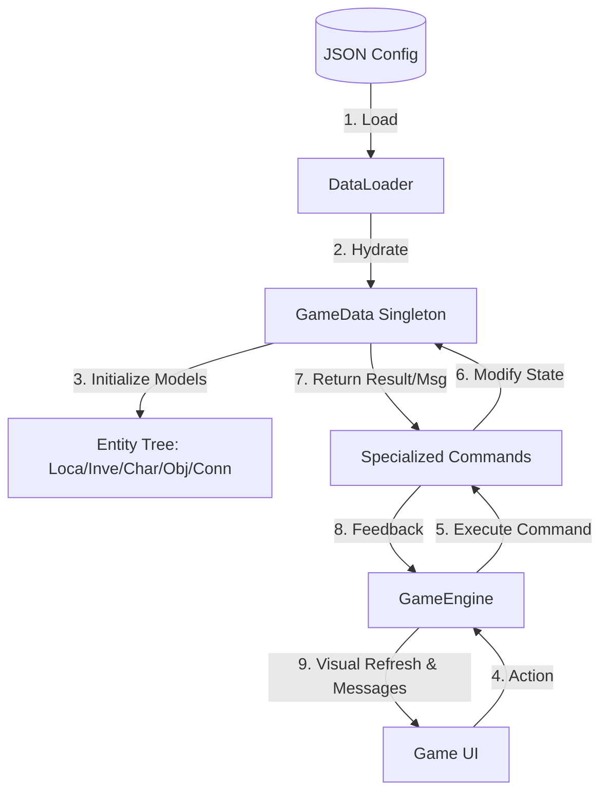

# Hi, I'm Jialin Li 👋 

**Honors Computer Science @ Western University | Aspiring AI & Systems Researcher**

* **Bridging Industry & Academia**: 6-7 years of professional experience in Human Resources & Talent Strategy at **Qiniu Cloud AI Lab** and **Suprema**, now pivoting to core Systems and AI research.
* **Academic Excellence**: Maintaining a **95/100 Major GPA** in core subjects including Algorithms, Operating Systems, and Mathematical Structures.

---

### 🔍 Research & Technical Interests

* **System Architecture**: Specialized in **data-driven decoupled systems** and Object-Oriented Design (OOD) principles, focusing on building scalable software infrastructures.
* **Machine Learning & Statistical Inference**: Deeply interested in the mathematical foundations of ML, including ensemble methods, bias-variance trade-offs, and predictive modeling.

---

## 🏆 Featured Project: Scalable Logic Engine (CS2212)

**Final Grade:** 100%  
**Role:** Lead Architect & Team Lead  
[👉 **View Full Project Repository & SDLC Documentation**](https://www.google.com/search?q=https://github.com/jialin-uwo/Scalable-Logic-Engine)

---

### 🧠 Architecture & Engineering Highlights

- **Stateless Command Pattern:**  
  Decoupled interactive logic (`Talk`, `Give`, `Use`, `Examine`, etc.) into specialized modules, keeping the core engine agnostic of specific business rules.

- **Attribute-Based Causal Chaining:**  
  Implemented an *Attribute Matching Engine* that enables recursive world-state transitions without hard-coded triggers.

- **Industrial QA Standards:**  
  Achieved a **100% pass rate** across **72 automated test cases**, covering Unit, Integration, Validation, and System testing.

- **Full SDLC Documentation:**  
  Migrated comprehensive artifacts from GitLab Wiki, including Domain Analysis, UML Design Specs, and Weekly Meeting archives.

---

### 📊 Ongoing Project: C++ Financial Ledger (CS3307)
*Demonstrating rigorous OOD principles and high-performance C++ backend design.*

* **Modular Orchestration**: Implemented a `LedgerController` to manage data flow between UI and analytical modules.
* **Data Access Decoupling**: Utilized a **DAO pattern** to ensure core financial logic is independent of storage formats.
* **Professional Standards**: All APIs are documented using **Doxygen** to ensure industry-grade maintainability.

---

### 📫 Connect with me
* **Email**: [jli4824@uwo.ca](mailto:jli4824@uwo.ca)
* **Location**: London, Ontario, Canada 🇨🇦
